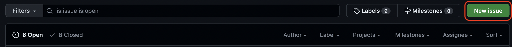
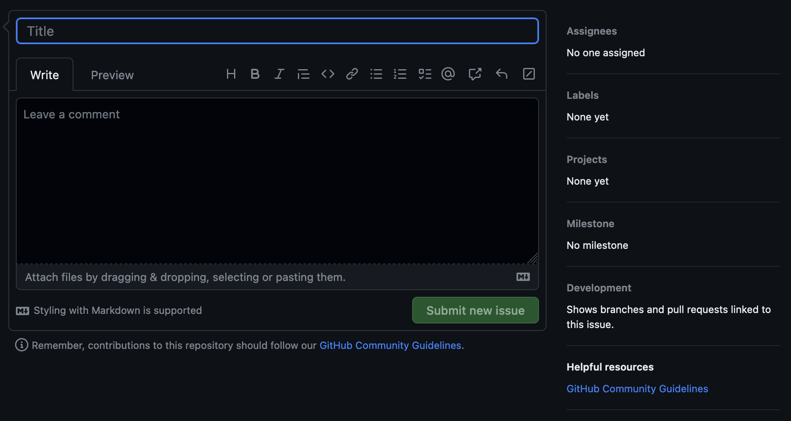
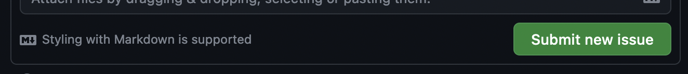
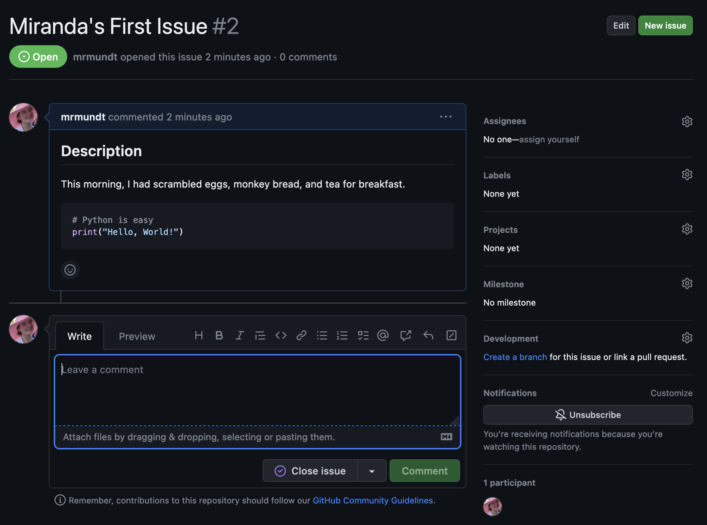
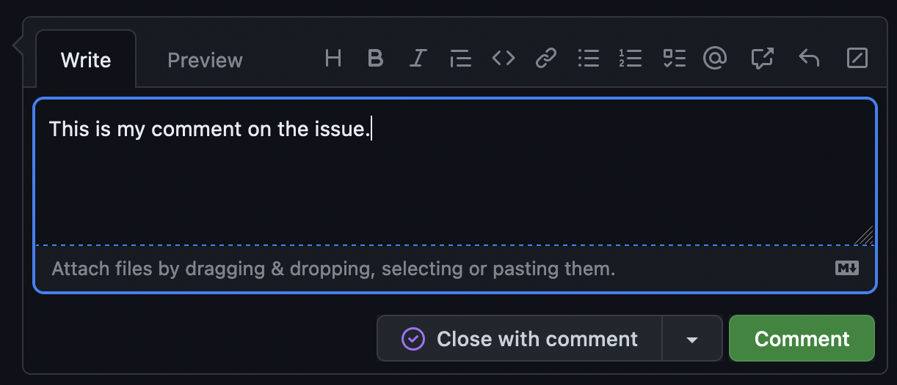
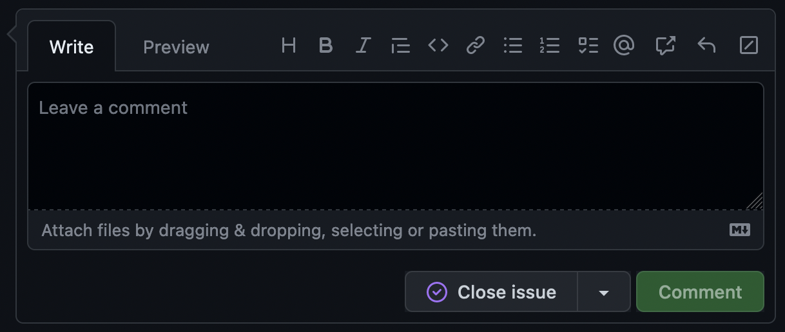
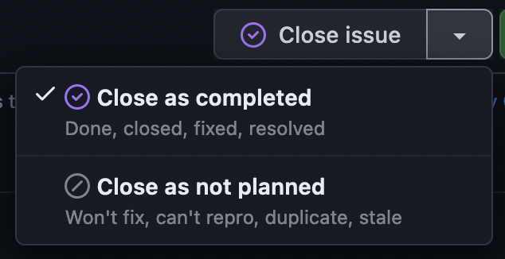

::::::::::::::::::::::::::::::::::::::: objectives

- "Become familiar with basic actions on GitHub Issues"

::::::::::::::::::::::::::::::::::::::::::::::::::

:::::::::::::::::::::::::::::::::::::::: questions

- "How do you make an issue?"
- "How do you interact with an open issue?"
- "How do you close an issue?"

::::::::::::::::::::::::::::::::::::::::::::::::::

## Open an Issue

To open a new issue, navigate to the issue page. Here you will see a green
"New issue" button. Click this to start the creation of a new issue.

{alt='New issue button circled in red'}

This will load a new page with an empty issue.

{alt='Empty issue page after clicking new issue button'}

A new issue has several parts:

- _Title_: This will display on the main "Issue" page.
- _Write_: This is an open area for the details of the issue. GitHub support Markdown formatting.
- _Preview_: This will preview the Markdown-rendered version of the details.

Once an issue is filled out, the "Submit new issue" button will highlight.

{alt='Submit new issue button highlighted and available to press'}

:::::::::::::::::::::::::::::::::::::::  challenge

## Open a New Issue

Navigate to your practice repository's issue page.
 
* Open a new issue titled "[YOUR NAME]'s First Issue"
* In the "Write" section, make a heading entitled "Description"
* Write a short sentence telling us what you ate for breakfast this morning
* Add a code block with "Hello, World" coded in your favorite language
* Preview your issue to make sure it looks right
* Submit the issue!

::::::::::::::::::::::::::::::::::::::::::::::::::

On the right-hand side, there are more options that can be modified.

- _Assignee_: Here you can choose a specific person to this issue.
- _Labels_: Here you can add a label to the issue (we will discuss this more later!).
- _Projects_: Here you can add the issue to a project board.
- _Milestone_: Here you can add the issue to a milestone.

:::::::::::::::::::::::::::::::::::::::::  callout

## Authorization Required

You will only be able to edit these options if you have the
appropriate permissions!

::::::::::::::::::::::::::::::::::::::::::::::::::

## Interact with an Open Issue

There are many interactions available on an open issue.

{alt='A basic open issue based on the exercise above'}

The most basic interaction with an open issue is leaving a comment. This is
how you can interact with the issue author, the assignee, and others who
have commented on or subscribed to the issue.

Simply click in the comment box at the bottom of the issue, type whatever
you'd like, and click "Comment."

{alt='Add a comment box on a new issue'}

:::::::::::::::::::::::::::::::::::::::::  callout

## Close by mistake?

Did you accidentally click "Close with comment"? No worries, you can easily
reopen it by clicking the "Reopen" button!

::::::::::::::::::::::::::::::::::::::::::::::::::

You can do other actions like "Edit" the title or original issue information,
tag other users, link to other issues or pull requests, and more.

:::::::::::::::::::::::::::::::::::::::  challenge

## Tag Your Instructor

Navigate to your issue from the previous exercise.
 
* Write a new comment on the issue, mentioning your instructor using
  the `@` symbol.
* Add the comment to the issue

::::::::::::::::::::::::::::::::::::::::::::::::::

## Close an Issue

We are done with this issue. We have completed the work on it, had our
discussion, and now we don't want it cluttering up our issue list.

Closing an issue is simple - just click the "Close issue" button.

{alt='Close issue button with no additional features'}

If you start to type in the comment box, this will change into a "Close with 
comment" button.

The dropdown to the right shows two more options:

{alt='Close issue button additional options'}

:::::::::::::::::::::::::::::::::::::::  challenge

## Issue Completed

Navigate to your issue from the previous exercises.
 
* Close the issue (no comment!)
* Reopen the issue
* Close the issue again with a comment of your choice

::::::::::::::::::::::::::::::::::::::::::::::::::

You now know the basic actions you can take on a GitHub issue!

:::::::::::::::::::::::::::::::::::::::: keypoints

- "New issues can be opened in a repository using the 'New issue' button."
- "Text on issues use Markdown styling for formatting."
- "A user can interact with issues in multiple ways: commenting, mentioning others, linking to other issues and pull requests, and more."

::::::::::::::::::::::::::::::::::::::::::::::::::

