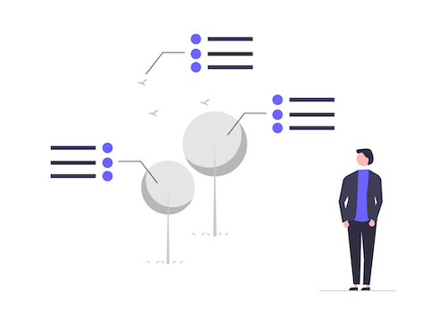
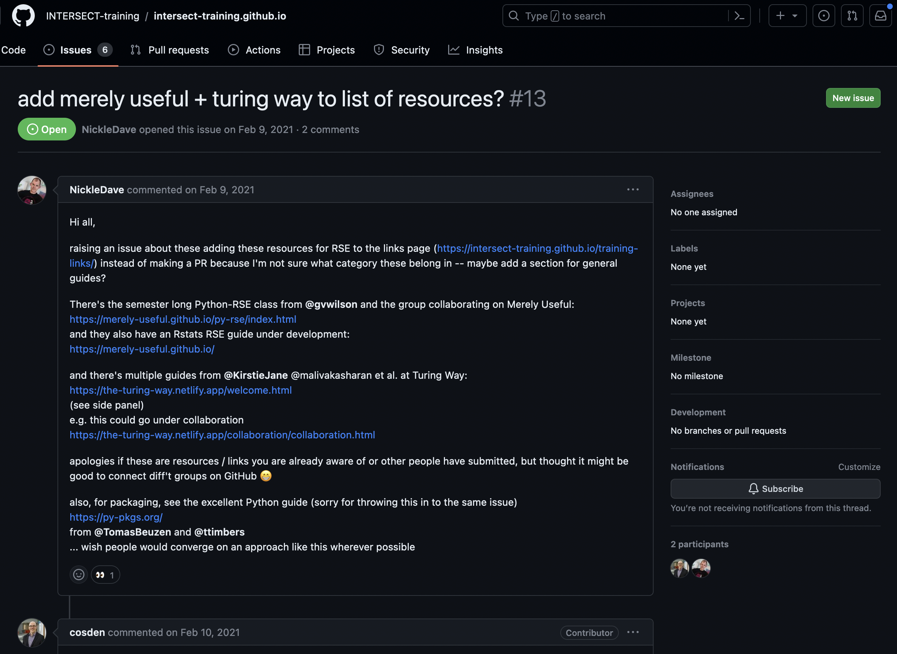
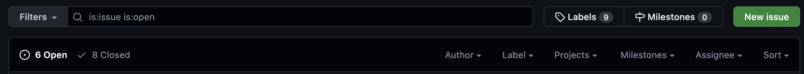

::::::::::::::::::::::::::::::::::::::: objectives

- "What is issue tracking?"
- "Why is issue tracking useful?"

::::::::::::::::::::::::::::::::::::::::::::::::::

:::::::::::::::::::::::::::::::::::::::: questions

- "Understand the purpose and benefits of issue trackers"
- "Become familiar with GitHub Issues"

::::::::::::::::::::::::::::::::::::::::::::::::::

## What is Issue Tracking?

Issue tracking is an activity that happens as part of Project Management. In
this activity, a record is made of bugs, enhancements, and requests in such
a way that the team is able to view and access the list of work to be
done.

Issues are used to collaborate, solve problems, and plan work, which is 
enabled by software tools such as GitLab issues, Jira story boards, and GitHub issues.

{alt='Collaborative tracking in the public eye'}

Issue trackers can be internal (team-facing) or external (user-facing). In
this lesson, students will learn about issue tracking through the use of GitHub
Issues.

## The Benefits of Issue Tracking

Issue tracking has numerous benefits. Some of the main ones are:

- _Visibility_: Work to be done is captured in one location where all team members can access it
- _Collaboration_: Issue trackers enable good project collaboration. Work can be captured, organized, managed, and discussed in a single location
- _Transparency_: If the issue tracking system is user-facing, users can see the status of work completed and add more information

## GitHub Issues

Numerous different issue tracking systems exist - both commercial and open-source,
integrated and stand-alone.

GitHub integrates issue tracking into their version control system. Every project
on GitHub can enable an integrated issue tracker.

{alt='INTERSECT training repository navigation bar'}

To access a repository's issues, simply navigate to the repository root
page and click on "Issues" in the navigation bar. This will take you to the
page of all "Open" issues.

{alt='INTERSECT training repository issues pages'}

Click on an issue to open it and read its details, plus any discussion
on that issue.

{alt='INTERSECT training repository issue 13 details'}

You can also change the default filter on the Issues page by status ("Open" or
"Closed"), author, and more.

{alt='Issue top-bar filter options'}

:::::::::::::::::::::::::::::::::::::::  challenge

## Browsing Open Issues

Navigate to [https://github.com/spack/spack](https://github.com/spack/spack) and find the issues page.
 
* How many issues are currently open?
* How many have been closed?
* How many labels are there?

::::::::::::::::::::::::::::::::::::::::::::::::::

:::::::::::::::::::::::::::::::::::::::: keypoints

- "Issue tracking is the process of monitoring problems and requests for a software product."
- "Issue tracking enables a software development team to capture, organize, and manage work collaboratively."

::::::::::::::::::::::::::::::::::::::::::::::::::

